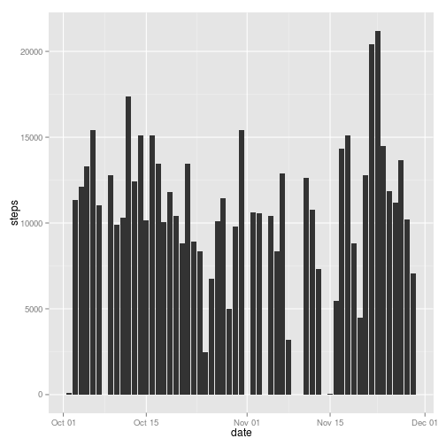
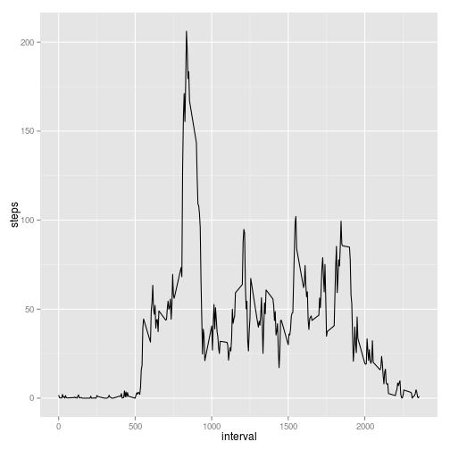
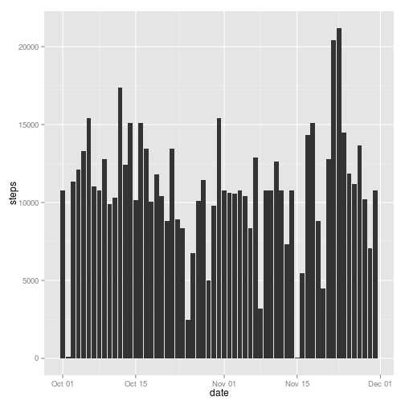
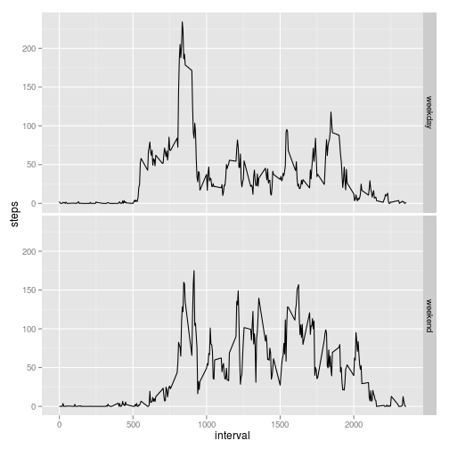

Loading and preprocessing of the data

```r
library(ggplot2)
library(dplyr)
library(lubridate)
setwd("/home/zeikko/Projects/RepData_PeerAssessment1")
unzip("activity.zip")
data <- read.csv("activity.csv")
data$date <- ymd(data$date)
```

Histogram of the total number of steps taken each day

```r
stepsByDate <- group_by(data, date)
stepsByDate <- summarise(stepsByDate, sum(steps))
names(stepsByDate) <- c("date", "steps")
qplot(date, steps, data=stepsByDate, geom="histogram", stat="identity")
```

```
## Warning: Removed 8 rows containing missing values (position_stack).
```

 

Mean of the total number of steps taken each day

```r
mean(stepsByDate$steps, na.rm=T)
```

```
## [1] 10766.19
```

Median of the total number of steps taken each day

```r
median(stepsByDate$steps, na.rm=T)
```

```
## [1] 10765
```

Average number of steps taken averaged across all days

```r
stepsByInterval <- group_by(data, interval)
stepsByInterval <- summarise(stepsByInterval, mean(steps, na.rm=T))
names(stepsByInterval) <- c("interval", "steps")
ggplot(stepsByInterval, aes(x=interval, y=steps)) + geom_line()
```

 

The number of missing values in the dataset

```r
sum(is.na(data$steps))
```

```
## [1] 2304
```

New dataset with missing values filled the average of that interval

```r
filledData = data
sum(is.na(data$steps))
```

```
## [1] 2304
```

```r
for(i in 1:nrow(data)) {
  if(is.na(data$steps[i])) {
    #print(data$steps[i])
    filledData$steps[i] <- filter(stepsByInterval, interval == data$interval[i])$steps
  }
}
```

Histogram of the total number of steps taken each day

```r
filledStepsByDate <- group_by(filledData, date)
filledStepsByDate <- summarise(filledStepsByDate, sum(steps))
names(filledStepsByDate) <- c("date", "steps")
qplot(date, steps, data=filledStepsByDate, geom="histogram", stat="identity")
```

 

Mean of the total number of steps taken each day

```r
mean(filledStepsByDate$steps, na.rm=T)
```

```
## [1] 10766.19
```

Median of the total number of steps taken each day
Adding the missing values causes the mean and the median to be the exact same value.

```r
median(filledStepsByDate$steps, na.rm=T)
```

```
## [1] 10766.19
```

Create a column indicating whether day is a weekday or weekend

```r
weekdayOrWeekend <- function(date) {
  weekday <- weekdays(date)
  if(weekday == 'Saturday' || weekday == 'Sunday') {
    day <- 'weekend'
  } else {
    day <- 'weekday'
  }
  day
}
weekdayData <- mutate(data, weekday=sapply(date, weekdayOrWeekend))
```

Make a time series plot of the steps taken in 5 minute interval averaged across all weekdays and weekend days

```r
stepsByInterval <- group_by(weekdayData, interval, weekday)
stepsByInterval <- summarise(stepsByInterval, mean(steps, na.rm=T))
names(stepsByInterval) <- c("interval", "weekday", "steps")
ggplot(stepsByInterval, aes(x=interval, y=steps)) + geom_line() + facet_grid(weekday ~ .)
```

 


